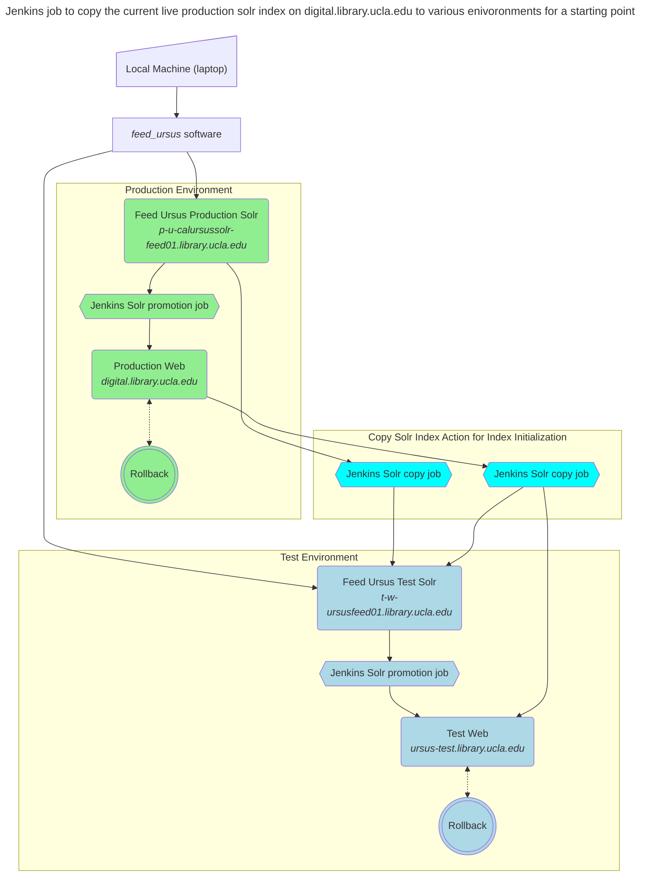

# Feed Ursus Workflow

```mermaid
---
title: Jenkins job to copy the current live production solr index on digital.library.ucla.edu to various enivoronments for a starting point
---
flowchart TB

 %% CLASSES
 classDef prod fill:lightgreen
 classDef test fill:lightblue
 classDef copy fill:cyan

 %% NODES
 laptop@{ shape: sl-rect, label: "Local Machine (laptop)" }

 test-feed("Feed Ursus Test Solr<br /><em>t-w-ursusfeed01.library.ucla.edu</em>")
 test-live("Test Web<br /><em>ursus-test.library.ucla.edu</em>")
 class test-feed,test-live test

 prod-feed("Feed Ursus Production Solr<br /><em>p-u-calursussolr-feed01.library.ucla.edu</em>")
 prod-live("Production Web<br /><em>digital.library.ucla.edu</em>")
 class prod-feed,prod-live prod

 feed-ursus@{ shape: rect, label: "<em>feed_ursus</em> software"}
 JPP{{Jenkins Solr promotion job}}
 JPT{{Jenkins Solr promotion job}}
 JRP(((Rollback)))
 JRT(((Rollback)))
 class JPP,JRP prod
 class JPT,JRT test

 JCL{{Jenkins Solr copy job}}
 JCF{{Jenkins Solr copy job}}
 class JCL,JCF copy

 %% DATA FLOW
 laptop --> feed-ursus
 feed-ursus --> test-feed
 feed-ursus --> prod-feed

 subgraph Production Environment
   prod-feed --> JPP --> prod-live
   prod-live <-.-> JRP
 end

 subgraph Test Environment
   test-feed --> JPT --> test-live
   test-live <-.-> JRT
 end

 subgraph Copy Solr Index Action for Index Initialization
   prod-feed --> JCF --> test-feed
   prod-live --> JCL --> test-live
                 JCL --> test-feed
 end
```
