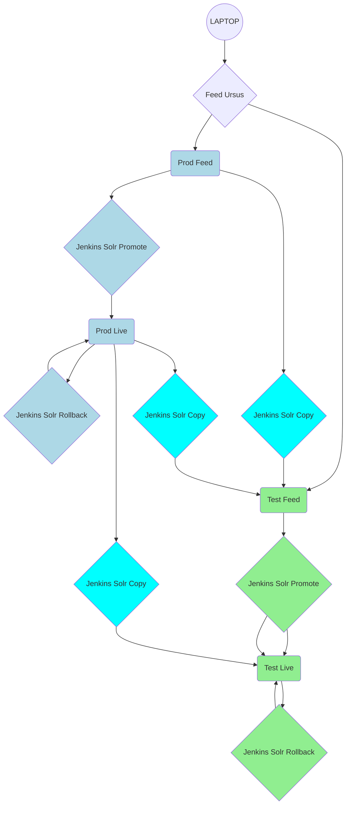

# Feed Ursus Workflow

```mermaid
flowchart TD;
 L((LAPTOP));

 TF(Test Feed);
 TL(Test Live);
 style TF fill:lightgreen
 style TL fill:lightgreen

 PF(Prod Feed);
 PL(Prod Live);
 style PF fill:lightblue
 style PL fill:lightblue

 FU{Feed Ursus};
 JPP{Jenkins Solr Promote};
 JPT{Jenkins Solr Promote};
 JRP{Jenkins Solr Rollback};
 JRT{Jenkins Solr Rollback};
 style JPP fill:lightblue
 style JRP fill:lightblue
 style JPT fill:lightgreen
 style JRT fill:lightgreen

 JCL{Jenkins Solr Copy};
 JCF{Jenkins Solr Copy};
 JCPF{Jenkins Solr Copy};
 style JCL fill:cyan
 style JCF fill:cyan
 style JCPF fill:cyan

 L --> FU;
 FU --> TF;
 FU --> PF;
 PF --> JPP --> PL;
 PL --> JRP --> PL;
 PF --> JCPF --> TF;
 TF --> JPT --> TL;
 TL --> JRT --> TL;
 JPT --> TL;
 PL --> JCL --> TL;
 PL --> JCF --> TF;
```
